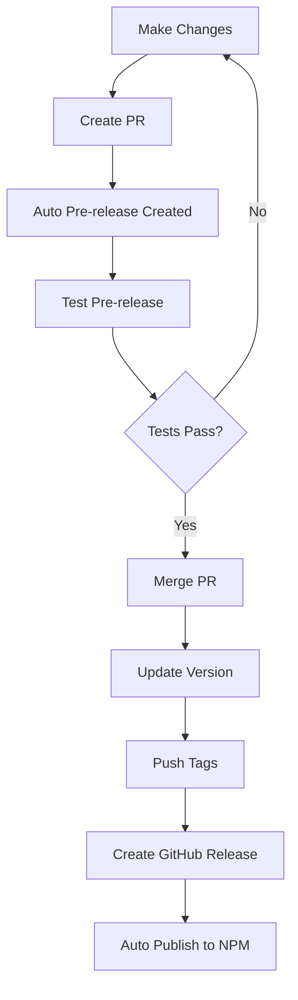

# Release Process

Guide for versioning, releasing, and publishing the BMAD MCP Server.

## Versioning

This project follows [Semantic Versioning](https://semver.org/) (MAJOR.MINOR.PATCH):

- **MAJOR**: Breaking changes (e.g., 1.0.0 → 2.0.0)
- **MINOR**: New features, backward compatible (e.g., 0.1.0 → 0.2.0)
- **PATCH**: Bug fixes, backward compatible (e.g., 0.1.0 → 0.1.1)

## Testing Changes with Pre-releases

### Automatic PR Pre-releases

When you open a Pull Request, GitHub Actions automatically creates a pre-release that you can test on another machine.

**How it works:**

1. **Open a PR** - A pre-release is automatically created with tag `pr-{number}-{sha}`
2. **Check the PR comments** - The bot will post installation instructions
3. **Test on another machine** using npx:

   ```json
   {
     "servers": {
       "bmad": {
         "command": "npx",
         "args": [
           "-y",
           "git+https://github.com/mkellerman/bmad-mcp-server#main"
         ]
       }
     }
   }
   ```

4. **Pre-release cleanup** - Automatically deleted when PR is merged or closed

**Benefits:**

- Test changes before merging
- No need to clone locally on every machine
- Works with any MCP client (VS Code, Claude Desktop, Cursor, etc.)
- Clean automatic cleanup

### Testing Locally

To test changes locally before creating a PR:

```bash
# Make your changes
npm run build

# Test the built version
node build/index.js

# Or run in dev mode
npm run dev
```

## Creating a Release

### Pre-Release Checklist

Before creating a release, ensure:

- [ ] All tests pass: `npm test`
- [ ] Linting passes: `npm run lint`
- [ ] Build succeeds: `npm run build`
- [ ] Update CHANGELOG.md with changes
- [ ] All changes committed to main/v2-node branch
- [ ] Pull latest from main/v2-node branch

### Release Steps

1. **Update version** using npm's built-in commands:

   ```bash
   # For a patch release (0.1.0 → 0.1.1)
   npm version patch

   # For a minor release (0.1.0 → 0.2.0)
   npm version minor

   # For a major release (0.1.0 → 1.0.0)
   npm version major
   ```

   This automatically:
   - Updates `version` in `package.json` and `package-lock.json`
   - Creates a git commit with message "v0.1.1"
   - Creates a git tag "v0.1.1"

2. **Push the tag to GitHub**:

   ```bash
   git push origin v2-node --follow-tags
   ```

3. **Create a GitHub Release**:
   - Go to [GitHub Releases](https://github.com/mkellerman/bmad-mcp-server/releases)
   - Click "Draft a new release"
   - Select the tag you just pushed (e.g., `v0.1.1`)
   - Add release title (e.g., "v0.1.1 - Bug fixes and improvements")
   - Add release notes describing changes, bug fixes, and new features
   - Click "Publish release"

4. **Automated Publishing**:
   - GitHub Actions will automatically run the `release.yml` workflow
   - It will:
     - Run linting checks
     - Run unit tests
     - Build the package
     - Publish to npm with provenance (requires `NPM_TOKEN` secret)

## NPM Token Setup

To enable automated npm publishing, configure an NPM token in GitHub secrets.

### Generate NPM Token

1. Log in to [npmjs.com](https://www.npmjs.com/)
2. Go to Account Settings → Access Tokens
3. Click "Generate New Token"
4. Select "Automation" token type
5. Copy the token (you won't see it again!)

### Add to GitHub Secrets

1. Go to repository Settings → Secrets and variables → Actions
2. Click "New repository secret"
3. Name: `NPM_TOKEN`
4. Value: paste your npm token
5. Click "Add secret"

## Manual Publishing

If automated publishing fails or you need to publish manually:

```bash
# Ensure you're logged in to npm
npm login

# Build the package
npm run build

# Publish
npm publish --access public
```

### Verify Publication

After publishing:

1. Check [npm package page](https://www.npmjs.com/package/bmad-mcp-server)
2. Verify version number is correct
3. Test installation:
   ```bash
   npx bmad-mcp-server@latest
   ```

## Release Workflow

### Standard Release Workflow



### Hotfix Workflow

For urgent fixes:

1. Create hotfix branch from main
2. Make minimal changes
3. Create PR with "hotfix" label
4. Fast-track review
5. Merge and release as PATCH version
6. Consider backporting to older versions if needed

## Version History Best Practices

### CHANGELOG.md Format

Use this format for changelog entries:

```markdown
## [0.2.0] - 2025-01-15

### Added

- New workflow for automated testing
- Support for custom agent configurations

### Changed

- Improved error messages in manifest loader
- Updated documentation structure

### Fixed

- Path resolution on Windows
- Memory leak in file scanner

### Deprecated

- Old configuration format (will be removed in v1.0.0)
```

### Commit Messages

Follow [Conventional Commits](https://www.conventionalcommits.org/):

- `feat:` - New features (MINOR version bump)
- `fix:` - Bug fixes (PATCH version bump)
- `BREAKING CHANGE:` - Breaking changes (MAJOR version bump)
- `docs:` - Documentation only
- `chore:` - Maintenance tasks
- `refactor:` - Code restructuring
- `test:` - Test updates

## GitHub Actions Workflows

### Release Workflow

Triggered on: GitHub Release published

Steps:

1. Checkout code
2. Setup Node.js 18
3. Install dependencies
4. Run linting
5. Run tests
6. Build package
7. Publish to npm with provenance

### PR Pre-release Workflow

Triggered on: Pull Request opened/updated

Steps:

1. Build package
2. Create pre-release tag
3. Comment on PR with installation instructions
4. Auto-delete on PR close/merge

## Troubleshooting Releases

### Release workflow fails

**Check:**

- NPM_TOKEN is valid
- Tests are passing
- Build succeeds locally
- GitHub Actions logs for specific error

### Version conflict

**Solution:**

```bash
# Pull latest
git pull origin v2-node

# Retry version bump
npm version patch
git push origin v2-node --follow-tags
```

### npm publish permission denied

**Solution:**

1. Verify you're logged in: `npm whoami`
2. Check package ownership on npmjs.com
3. Ensure NPM_TOKEN has correct permissions
4. Try manual publish with `npm publish --access public`

## Best Practices

1. **Always test before releasing**
   - Run full test suite
   - Test on multiple platforms if possible
   - Verify in different MCP clients

2. **Keep changelog updated**
   - Update as you make changes, not at release time
   - Be specific about what changed and why

3. **Use semantic versioning correctly**
   - Breaking changes = MAJOR
   - New features = MINOR
   - Bug fixes = PATCH

4. **Communicate changes**
   - Write clear release notes
   - Mention breaking changes prominently
   - Include migration guides for MAJOR versions

5. **Tag and release from stable branch**
   - Ensure main/v2-node is stable
   - Don't release from feature branches

## Support and Questions

For release-related questions:

- Check [GitHub Actions](https://github.com/mkellerman/bmad-mcp-server/actions)
- Review [existing releases](https://github.com/mkellerman/bmad-mcp-server/releases)
- Open an [issue](https://github.com/mkellerman/bmad-mcp-server/issues) if you encounter problems
